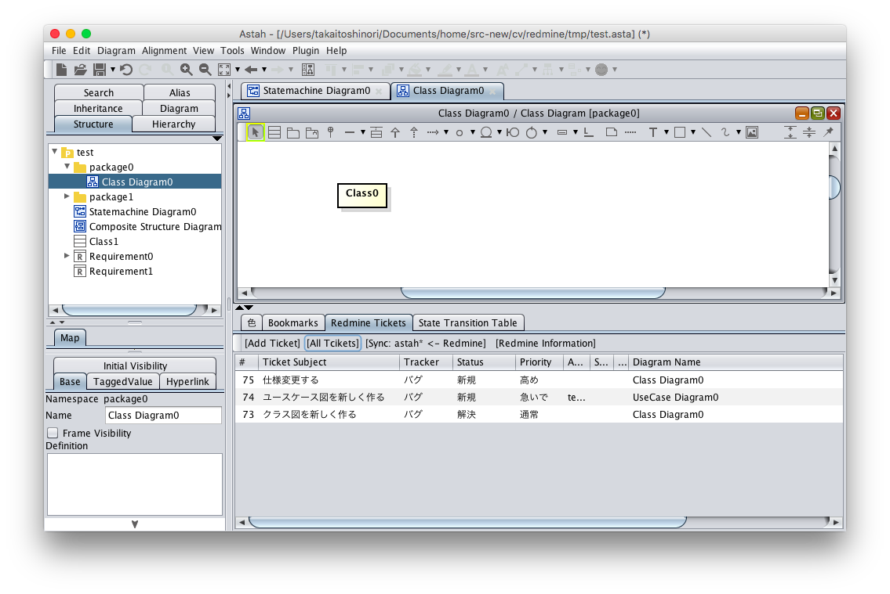
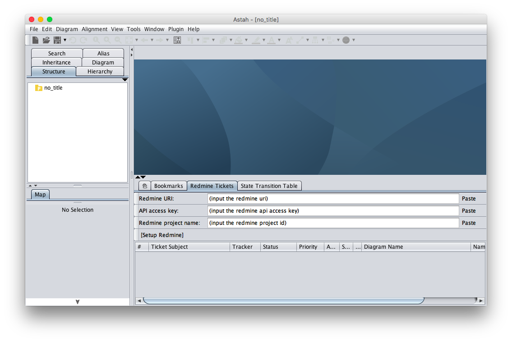
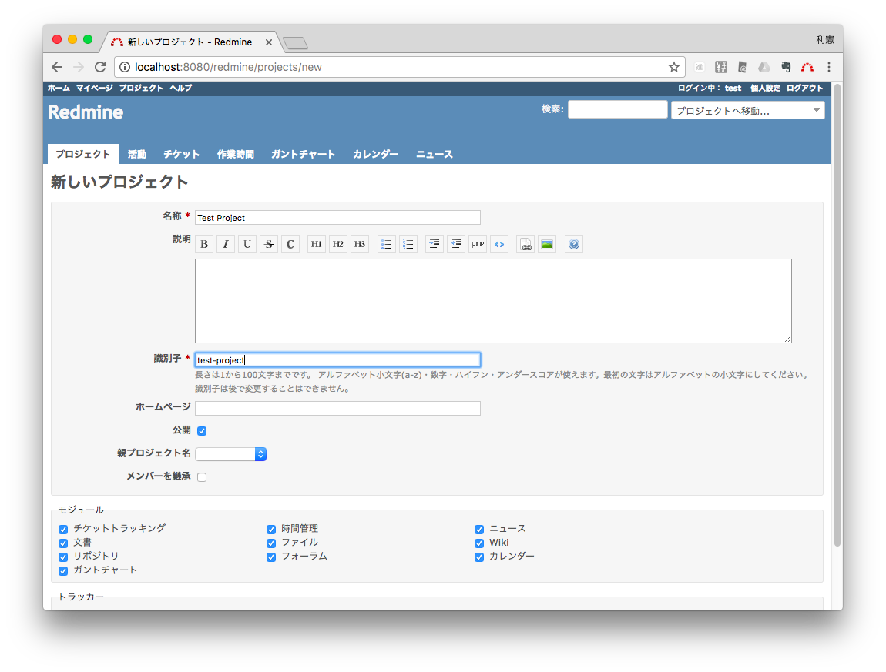
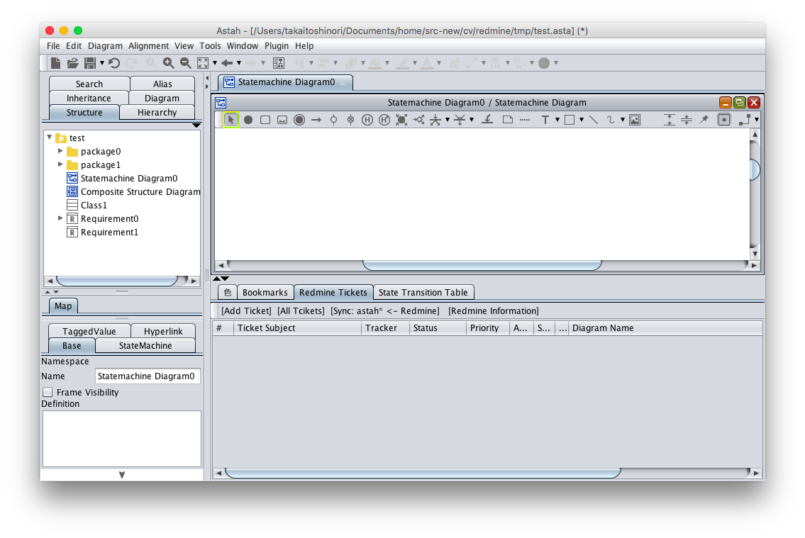

Redmine Plugin
===============================

Version
----------------
1.0

Available for
----------------
Astah Professional 6.6 or later, Astah SysML 1.2 or later, Astah GSN 1.1 or later

Description
----------------
Astah Redmine Plugin enables you to associate Redmine tickets with Astah diagrams.

How to install
----------------
[Download Astah Redmine Plugin.](http://astah.change-vision.com/ja/feature/redmine.html)

### [If you are using Astah Professional]
1. Launch Astah and drag the downloaded .jar file to an open instance of Astah. A pop-up will appear asking you to confirm installation, choose [Yes].
3. If the pop-up opens, restart Astah and open any project
3. Now you will have [Redmine Tickets] tab below the Diagram Editor

### [If you are using Astah SysML]
1. Launch Astah and go to [Help] - [Plugin List]
2. Click [Install] button and select the .jar file you downloaded
3. Restart Astah and open any project
3. Now you will have [Redmine Tickets] tab below the Diagram Editor

### [If you are using Astah GSN]
1. Save the downloaded .jar file under Userhome/.astah/gsn/plugins
2. Restart Astah and open any project
3. Now you will have [Redmine Tickets] tab below the Diagram Editor

How to use
----------------
### Setup

1. The [Redmine Tickets] view will look like the figure below when the Astah project is not associated with Redmine yet.

2. Input Redmine URI, API access key and your redmine project name. Use the [Paste] button for each other than keyboard shortcuts. Note that the ''Redmine project name'' means the project id, not the project names:

3. After filling out all the items, you can push [Setup Redmine]. If connecting to Redmine is succeeded, you will see menu buttons on the [Redmine Tickets] view, e.g. [Add Ticket].

### Creating a ticket

1. If you push [Add Ticket] button, a browser will launch and open the Redmine page where you can create new tickets.
2. In the ticket page of Redmine, you can update, fill out or set properties of the ticket, e.g. the ticket subject, the priority, etc. After creating tickets, pushing [Sync: astah*<-Redmine] button in the [Redmine Tickets] tab will import those tickets information.

### Showing ticket lists
* One ticket is associated with one diagram. When you move from a diagram to another, the ticket list will be also updated to show ones associated with the selected diagram.
* [All Tickets] button will show all the tickets associated with all the diagrams in the currently-open Astah project.
* Clicking any [Item] column will sort listed items accordingly.
* Width of each column is manually adjustable.
* Clicking Ticket number or ticket subject will open your browser to take you to the ticket page in Redmine. After you update the ticket information, you can sync it by pushing [Sync: Astah <- Redmine] button.
* Clicking Diagram name in the table will give a focus on the diagram. At the same time, the table will be updated to show the ticket list associated with that diagram.

### Ticket data in an Astah project
* Redmine information i.e. URI, API access key and redmine project id and all the ticket information associated with diagrams will be saved in the Astah file when closing Astah project. When you open the Astah project, those data in the table will be restored.
   - If the connection to the Redmine is not established when you opening Astah project, those data will not be restored.
   - Existing bug: When you open an Astah project right after launching Astah, restoring Redmine information may fail sometimes. In this case, open any other project you have, and then open the project you wanted again, then the data will be restored.

### Others
* Width of columns of the table will be restored in Astah project when you push [Sync: Astah<-Redmine] and when you save an Astah project, those width information will be saved in Astah file.

### Existing bug
* When you open an Astah project right after launching Astah, restoring Redmine information may fail sometimes. In this case, open any other project you have, and then open the project you wanted again, then the data will be restored.

License
---------------
Copyright 2018 Change Vision, Inc.

Licensed under the Apache License, Version 2.0 (the "License");
you may not use this work except in compliance with the License.
You may obtain a copy of the License in the LICENSE file, or at:

   <http://www.apache.org/licenses/LICENSE-2.0>

Unless required by applicable law or agreed to in writing, software
distributed under the License is distributed on an "AS IS" BASIS,
WITHOUT WARRANTIES OR CONDITIONS OF ANY KIND, either express or implied.
See the License for the specific language governing permissions and
limitations under the License.
