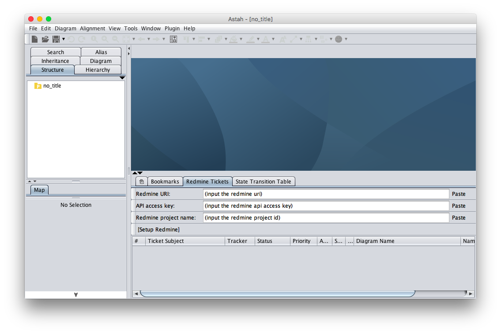

Redmineプラグイン
===============================

Version
----------------
1.0

Available for
----------------
astah* UML, professional 6.6 以降、astah* SysML 1.2以降、astah* GSN 1.1以降

Description
----------------
図に対して、Redmineのチケットを対応付けることができます。

How to install
----------------
[ここから、プラグイン.jarファイルをダウンロードします。](http://astah.change-vision.com/ja/feature/redmine.html)

### astah* UML、professional、SysMLをご利用の場合
1. 上部メニュー[ヘルプ] – [プラグイン一覧] からプラグイン一覧を開きます。
2. [インストール] ボタンをクリックし、jarファイルを選択してインストールしてください。
3. astah* を再起動し、プロジェクトを開きます。
4. 下部の拡張ビューに[Redmine Tickets]タブが追加されます。

(astah* UML、professional 6.8以降をご利用の場合は、ダウンロードした.jarファイルを、astah*のツールバーにドラッグ＆ドロップすることでもインストールが可能です。)

### astah* GSN をご利用の場合
1. <ユーザホーム>/.astah/gsn/pluginsフォルダに本プラグインのjarファイルを置きます。
2. astah*を起動し、プロジェクトを開きます。
3. 下部の拡張ビューに[Redmine Tickets]タブが追加されます。

使い方
----------------
### Redmineセットアップ

1. Redmineと対応付けられていない状態では、次のような画面になっています。

2. 各項目を入力してください。Pasteは、キーボードショートカットではなく、[Paste]ボタンをご利用ください。Redmine project name は、プロジェクトの識別子ですのでご注意ください。下の図の「識別子」のものです。

3. 全ての情報を入力した状態で、[Setup Redmine]ボタンを押し、Redmineとの接続に成功すれば、下の図のようになります。

### チケットの作成

1. [Add Ticket] を押すと、自動的にRedmineのチケット作成画面に飛びます。
2. Redmine上でチケットの題目や優先度など必要な情報を入力したあと、astah*上で[Sync: astah*<- Redmine]ボタンを押すことにより、Redmine上のチケット情報がastah*に反映されます。

### チケットの表示
* チケットは、図と対応付けられています。図を選択する毎に、選択された図に対応付けられてたチケットが表示されます。
* [All Tickets]ボタンを押すことにより、開いているastah*プロジェクトに含まれる全ての図に対応付けられたチケットが表示されます。
* 表の項目名をクリックすると降順や昇順に整列されます。
* 項目の幅は変えられます。
* チケット番号やチケットの題名をクリックすると、Redmine上のそのチケットに飛びます。必要に応じて、Redmine上でチケットの情報を更新したあと、[Sync: astah* <- Redmine]ボタンで、astah*プロジェクト上の情報も更新してください。
* 図の名前をクリックすると、その図を選択する状態になります。同時に、その図に関連付けられたチケットのみを表示する状態になります。

### astah*プロジェクトにおけるチケット情報
* astah*プロジェクトを閉じる際に、Redmineの情報及び、図に関連付けられたチケットの情報もプロジェクトファイルに保存されます。次回開いた時には、それらが回復します。
   - Redmineが接続可能でない場合には回復しません。
   - 既知の不具合: astah*を立ち上げた直後にプロジェクトファイルを開いた際には、Redmineの情報が回復しないことがあります。一度何らかのプロジェクトを開いた後、もう一度開けば回復します。

### その他
* 表の各項目の幅は、少し分かりにくいですが、[Sync: astah*<-Redmine]ボタンを押した際に、astahプロジェクトに反映し、プロジェクトの保存時に.astahファイルに保存されます。

### 既知の不具合
* astah*を立ち上げた直後にプロジェクトファイルを開いた際には、Redmineの情報が回復しないことがあります。一度何らかのプロジェクトを開いた後、もう一度開けば回復します。

License
---------------
Copyright 2018 Change Vision, Inc.

Licensed under the Apache License, Version 2.0 (the "License");
you may not use this work except in compliance with the License.
You may obtain a copy of the License in the LICENSE file, or at:

   <http://www.apache.org/licenses/LICENSE-2.0>

Unless required by applicable law or agreed to in writing, software
distributed under the License is distributed on an "AS IS" BASIS,
WITHOUT WARRANTIES OR CONDITIONS OF ANY KIND, either express or implied.
See the License for the specific language governing permissions and
limitations under the License.
